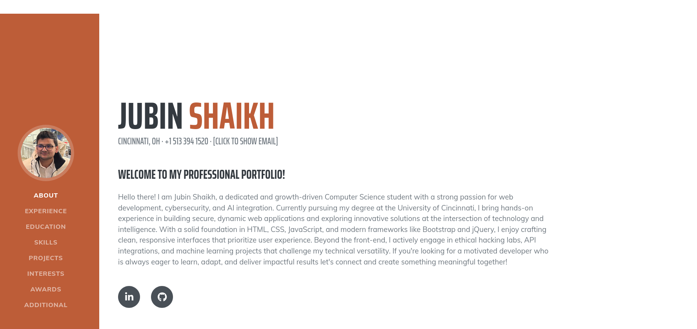

# WAPH-SHAIKHJN

# WAPH-Web Application Programming and Hacking

## Instructor: Dr. Phu Phung

## Student

**Name**: jubin shaikh

**Email**: [shaikhjn@mail.uc.edu]

**Short-bio**: jubin shaikh having fun with his new class web application programming and hacking. 

## Repository Information

[Repository on GitHub](https://github.com/Jubinshaikh/Jubinshaikh.github.io)

## Live website

[Live Website on GitHub Pages](https://jubinshaikh.github.io/)

### Individual project- 1 - Front-end Web Development with a Professional Profile Website and API Integration on github.io cloud service
 
 updated: 17-06-2025

 summary of the individual project

 -->This individual project focused on designing and deploying a personal professional profile website using GitHub Pages. The site includes my resume, headshot, education, experience, and technical skills, all organized within a responsive Bootstrap template

-->As part of the project, I implemented several interactive JavaScript features including a digital clock, analog clock, show/hide email (using jQuery), dark mode toggle, and two public API integrations. These dynamic elements enhance the user experience and demonstrate my practical front-end development skills.

-->Additionally, I used cookies to track return visits and embedded a page tracker to log website traffic. This project not only helped me apply what I’ve learned throughout the course but also gave me a live, professional portfolio I can share with recruiters and potential employers while applying for jobs.

General requirements (30 pts):

task 1:Create and deploy a personal website on GitHub cloud (github.io) as a professional profile with your resume, including your name, headshot, contact information, background, e.g., education, your experiences and skills (25 pts)

-->I built and published a personal website on GitHub Pages to serve as my professional profile. It features my name, headshot, contact info, resume, education, skills, and work experience—all organized using a modern, responsive Bootstrap layout. This site gives potential employers a quick and polished way to learn about me and what I bring to the table.

task2:Create a link to a new HTML page to introduce this "Web Application Programming and Hacking" course and related hands-on projects (5 ptt)

-->I created a separate HTML page linked from my main website to introduce the Web Application Programming and Hacking (WAPH) course. The page provides an overview of what the course covers, including front-end and back-end web development, web security concepts, and hands-on projects like labs and hackathons. This page highlights my learning experience and demonstrates how the course helped me develop practical skills through real-world application

Non-technical requirements (20 pts):

task 1:Use an open-source CSS template or framework such as Bootstrap

-->To meet the design and layout requirements, I used an open-source Bootstrap template as the foundation for my website. It helped me build a clean, responsive, and professional-looking profile without having to write all the CSS from scratch. I customized the template to reflect my personal branding and added my own content, styles, and interactive features.

-->You will be able to see the background and graphic of the website in below screenshot. 

task 2:Include a page tracker, for example: https://analytics Links to an external site.](https://analytics.withgoogle.com/ Links to an external site.), https://flagcounter.com/ Links to an external site..

-->To track visitor activity on my website, I integrated a page tracker using FlagCounter. It displays a visual counter of page views and visitor locations, allowing me to monitor engagement on my portfolio site in a simple and effective way.

Technical requirements (50 pts)

task 1:Use jQuery and one more open-source JavaScript framework/library to implement JavaScript code introduced in Lab 2, including a digital clock, an analog clock, show/hide your email, and one more functionality of your choice. (5 pts each)

-->To demonstrate my understanding of JavaScript from Lab 2, I used jQuery along with Moment.js as my two libraries. I implemented a digital clock and an analog clock with canvas-based drawing. I also added a show/hide email feature using jQuery to toggle visibility. As an extra functionality, I included a dark mode toggle that lets users switch between light and dark themes for better accessibility and user experience

task 2: Two public Web APIs integration (20 pts) Ensure you include a disclaimer stating that the public/third-party services generate the generated contents below and that you are not responsible.

-->To meet the API integration requirement, I used two public APIs. First, I integrated the JokeAPI to display a random joke from the "Any" category on my website. A new joke is fetched and displayed every minute using JavaScript. Second, I used the Dog CEO API to fetch and display a random dog image, adding a fun and graphic element to the page. Both integrations include a disclaimer making it clear that the content is generated by third-party services and I am not responsible for it

task 3:Use JavaScript cookies to remember the client (10 pts): If first-time visit, display the message "Welcome to my homepage for the first time!"; otherwise, display the message "Welcome back! Your last visit was the date/time of last visit" (ensure that you update this value the date/time of last visit each time the same user visits -2pts if missing

--> I implemented a cookie-based feature using JavaScript to recognize returning visitors. If someone visits the site for the first time, a welcome message says, "Welcome to my homepage for the first time!" For returning visitors, the site displays, "Welcome back! Your last visit was date/time." Each time the page is loaded, the cookie is updated to reflect the current visit. This feature adds a personal touch while demonstrating my ability to work with browser storage and date formatting in JavaScript

